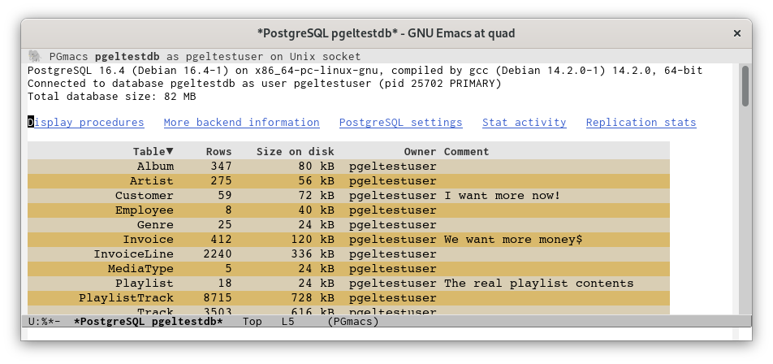

# PGMacs

An Emacs browser and editor for the PostgreSQL database.

PGMacs provides an editing interface for the PostgreSQL 🐘 object-relational DBMS from Emacs.
It allows you to:

- browse the **list of tables** in the database

- browse the contents of a table, row by row, in paginated mode for large tables

- edit the value of a column (type `RET` on the value you want to modify)

- copy/paste rows of a database table (type `k` to copy, `y` to paste in a table display buffer)

PGMacs works with Emacs running in a terminal (started with the `-nw` commandline option), or
running in your platform's window system.

## Status

PGMacs is in **alpha status**. Please only use it on test databases that do not contain important
data. 

The library has been tested with PostgreSQL version 16.2, but should work with any PostgreSQL
version supported by the `pg-el` library that it uses to communicate with PostgreSQL. The code has
been tested with Emacs 29.2 on Linux. It won't run with Emacs versions earlier than 29 because it
uses the `vtable` library.

## License

PGMacs is distributed under the terms of the GNU General Public License, version 2.

Copyright 2023-2024 Eric Marsden.

The **latest version** of this package should be available from

    https://github.com/emarsden/pgmacs/

