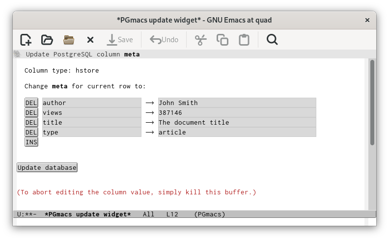
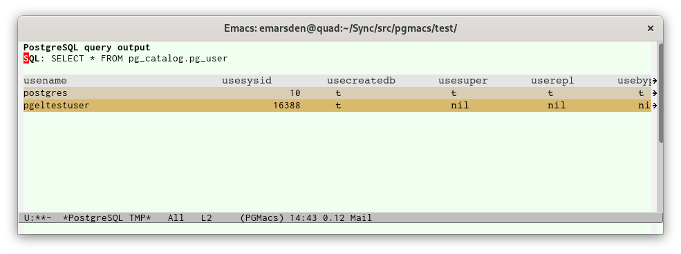

# Editing data in a PostgreSQL table

A row-list buffer shows some metainformation on the table and its columns, then the row data in tabular form.

If the table contains a large number of rows, the contents will be **paginated**, with `Next` and
`Previous` buttons to move page by page. The number of rows in each page is determined by the
variable `pgmacs-row-limit`.

A column which is a part of a primary key will be displayed using the customizable
`pgmacs-column-primary-key` face, which defaults to a bold version of the `pgmacs-table-data` face.
A column which references a foreign key will be displayed using the `pgmacs-column-foreign-key`
face, which defaults to a blue color.

The following keys are bound when the point is located in the row-list table:

| Key         | Binding                                                                              |
|-------------|--------------------------------------------------------------------------------------|
| `v`         | Display the value at point in a dedicated buffer.                                    |
| `RET`       | Edit the value at point in the minibuffer, or jump to foreign table.                 |
| `w`         | Edit the value at point in a widget-based buffer.                                    |
| `DEL`       | Delete the row at point.                                                             |
| `M-left`    | Move to the previous column.                                                         |
| `M-right`   | Move to the next column.                                                             |
| `o`         | Prompt for a table name and open a new buffer displaying that table's data.          |
| `+`         | Insert a new row into the current table, prompting for new values in the minibuffer. |
| `i`         | Insert a new row, prompting for new values in a dedicated buffer.                    |
| `k`         | Copy the current row.                                                                |
| `y`         | Paste (yank) the copied row.                                                         |
| `j`         | Copy the current row to the kill ring in JSON format.                                |
| `<`         | Move point to the first row of data.                                                 |
| `>`         | Move point to the last row of data.                                                  |
| number      | Move point to the nth column (numbering is zero-based).                              |
| `e`         | Open a new buffer to display the result of an SQL query.                             |
| `r`         | Redraw the table (does not refetch data from PostgreSQL).                            |
| `n`         | Next page of output (if table contents are paginated).                               |
| `p`         | Previous page of output (if table contents are paginated).                           |
| `S`         | Sort the table by the current column.                                                |
| `{`         | Make the current column narrower.                                                    |
| `}`         | Make the current column wider.                                                       |
| `T`         | Jump to the main PGmacs table-list buffer.                                           |
| `q`         | Kill the current buffer.                                                             |

## Editing a column value

If your table has a primary key, you can edit the contents of the table. To modify a value, move the
cursor to the relevant column value and type `RET`. This will prompt you for the new value, and
update the row to the value you specified (it sends PostgreSQL an SQL command similar to `UPDATE
table_name SET column_name to X WHERE pk_col1 = value1 AND pk_col2 = value2`, where `pk_col1` and
`pk_col2` are the names of the columns that comprise the primary key constraint).

Note that PGmacs tells you the column type when prompting for the new value. You must specify a
value in the format accepted by PostgreSQL for that type (check the current value as displayed in the
minibuffer if you’re unsure of the exepcted format).

For certain column types and very long column values, it may be more convenient to use the
**widget-based editing interface** to edit a column value. Move the cursor to the relevant column value
and type `w`. This will open a dedicated buffer with an editing widget suitable for that column’s
type, as illustrated below for an HSTORE key->value map.

If you wish to abort editing, simply kill this editing buffer.

## Inserting, copying and deleting rows

To insert a new row into a table, press `+` in the table buffer. You will be prompted for the values
of each column for which a default value is not specified (in the minibuffer), then the new row will
be inserted. You can also insert a new row by entering new values in a widget-based buffer by
pressing `i` (this may be more convenient if the table contains many rows, or the values to enter
are very long).

To delete the row at point, press `<delete>` or `<backspace>` in a table buffer and confirm. Please
note that this deletes the current row in the PostgreSQL database, as well as in the Emacs buffer.
Deleting rows is only possible on tables that include a primary key constraint (this can be a single
column specified as `PRIMARY KEY`, or a constraint across a group of columns).

To copy/paste rows, press `k` to copy the row to the PGmacs kill buffer (this only copies, without
deleting the row), then `y` to insert a new row with the same values. Any columns that have a
default value specified (for example, primary key rows that pull a value from an integer sequence,
or are specified as `SERIAL`, or timestap values that default to `now`) will be inserted with a new
generated value, rather than the value in the copied row.

All updates, insertions and deletions are immediately made on the PostgreSQL server by sending it
the appropriate SQL `UPDATE TABLE`, `DELETE FROM` or `INSERT INTO` commands. 

## Follow foreign key references

A column that references data in a foreign table (`FOREIGN KEY`) will be shown in blue. If you type
`RET` when point is located on a foreign key reference, PGmacs will jump to the referenced row and column in
the other table. A new row-list buffer is opened; type `q` to come back to the orginal row-list
buffer.

## Viewing output from an SQL query

You can also view (but obviously not edit!) the output from an SQL query you enter. Type `e` in a
PGmacs buffer, which will prompt you for an SQL query, then display the output in a dedicated
temporary buffer. Type `q` to kill the temporary buffer.

