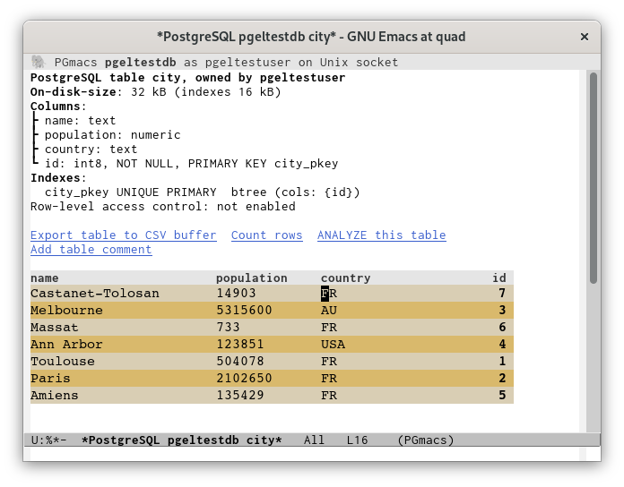

# Quickstart

You will need the [pg-el library](https://github.com/emarsden/pg-el/) installed, available in
the [MELPA](https://melpa.org/) package archive:

    M-x package-install RET pg

PGmacs is not currently distributed in MELPA. In the meantime, do the following in a terminal:

    git clone https://github.com/emarsden/pgmacs.git

Load the library from Emacs with 

    M-x load-file RET /path/to/pgmacs/pgmacs.el

## Connecting to a PostgreSQL database

With the pgmacs.el library loaded, say 

    M-x pgmacs
    
This will open a widget-based buffer to collect connection information (database name, hostname,
port, etc.). 

It will then open the PGmacs main buffer, which will show you a list of the tables available in the
database.

You can also open PGmacs with:

- a PostgreSQL connection object from the pg.el library, using function `pgmacs-open`

- a PostgreSQL connection string such as `user=myself port=5432 dbname=mydb`, using function
  `pgmacs-open/string`

- a PostgreSQL connection URI such as `postgresql://%2Fvar%2Flib%2Fpostgresql/dbname`, using
  function `pgmacs-open/uri`.

## Browsing a table

From the buffer that displays a list of the tables in the database you are connected to, type `RET` on
the name of a table to enter a table buffer. This presents some metainformation on the table and its
columns, then the rows in the table.

If the table contains a large number of rows, the contents will be **paginated**, with `Next` and
`Previous` buttons to move page by page. The number of rows in each page is determined by the
variable `pgmacs-row-limit`.

The following keys are bound when the point is located in the table: 

| Key       | Binding                                                             |
|-----------|---------------------------------------------------------------------|
| S         | Sort the table by the current column.                               |
| {         | Make the current column narrower.                                   |
| }         | Make the current column wider.                                      |
| M-<left>  | Move to the previous column.                                        |
| M-<right> | Move to the next column.                                            |
| q         | Kill the current buffer.                                            |
| +         | Insert a new row into the current table.                            |
| d         | Delete the current row.                                             |
| k         | Copy the current row.                                               |
| y         | Paste (yank) the copied row.                                        |
| e         | Open a new buffer to display the result of an SQL query.            |

## Editing a column value

If your table has a primary key, you can edit the contents of the table. To modify a value, move the
cursor to the relevant column and type `RET`. This will prompt you for the new value, and update the
row to the value you specified (it sends PostgreSQL an SQL command similar to `UPDATE table_name SET
column_name to X WHERE pk_col = the_value`).

Note that PGmacs tells you the column type when prompting for the new value. You must specify a
value in the format accepted by PostgreSQL for that type.

## Viewing output from an SQL query

You can also view (but not edit!) the output from an SQL query you enter. Type `e` in a PGmacs
buffer, which will prompt you for an SQL query, then display the output in a dedicated temporary
buffer. Type `q` to kill the temporary buffer.

## Inserting, copying and deleting rows

To insert a new row into a table, press `+` in the table buffer. You will be prompted for the values
of each column for which a default value is not specified, then the new row will be inserted. 

To delete the row at point, press `<delete>` or `<backspace>` in a table buffer and confirm. Please
note that this deletes in the PostgreSQL database, not only in the Emacs buffer.

To copy/paste rows, press `k` to copy the row to the PGmacs kill buffer (this only copies, without
deleting the row), then `y` to insert a new row with the same values. Any columns that have a
default value specified (for example, primary key rows that pull a value from an integer sequence,
or are specified as `SERIAL`, or timestap values that default to `now`) will be inserted with a new
generated value, rather than the value in the copied row.

All updates, insertions and deletions are immediately made on the PostgreSQL server by sending it
the appropriate SQL `UPDATE TABLE`, `DELETE FROM` or `INSERT INTO` commands. 
