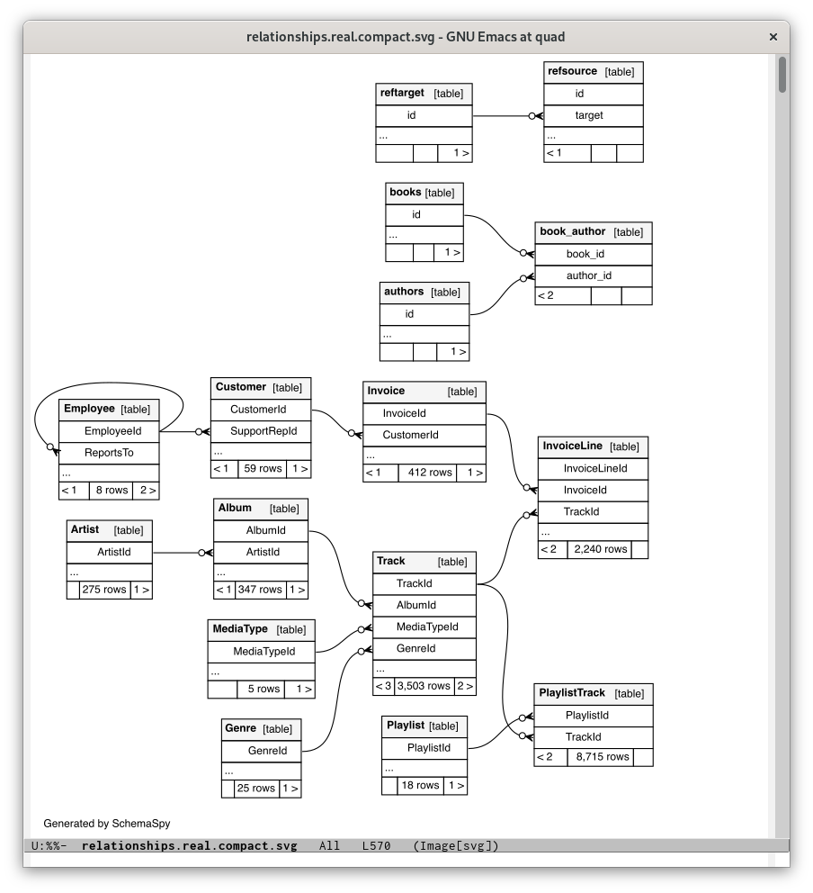

# Running SchemaSpy

The [SchemaSpy application](https://schemaspy.org/) is able to generate useful illustrations
documenting the tables present in a database, the links between them and their schema structure.
PGmacs includes functionality to run SchemaSpy on the database and table you are viewing, and
display the relevant images in an Emacs buffer. This functionality only works in graphical mode (not
in the terminal) and requires your Emacs to support SVG images; PGmacs will inform you if these
conditions are not met.

In the main table-list buffer, type `S` to run SchemaSpy on the current database and display the
relationships between the tables in a dedicated buffer.



In a row-list buffer, type `S` to run SchemaSpy the on the current table and view the table
structure diagram in a dedicated buffer.


See the customizable variable `pgmacs-schemaspy-cmdline` to adjust the commandline which runs
SchemaSpy to your local installation.


## Running in a software container (Podman/Docker)

The default setting for `pgmacs-schemaspy-cmdline` runs SchemaSpy in a prebuild Docker/Podman
software container. You will need to have [Podman](https://podman.io/) or Docker installed (we
recommend Podman, because it's fully free software and it runs well in rootless mode, which is
better for security). This is the easiest way of running SchemaSpy, because all necessary
dependencies are preinstalled. The container image is around 380MB in size.

```shell
podman run -v %D:/output --network=host docker.io/schemaspy/schemaspy:latest -t pgsql11 -host %h
-port %P -u %u -p %p -db %d -imageformat svg
```

Some notes on customizing this commandline:

- Replace `podman` by `docker` if that is your preference.

- The official SchemaSpy container `docker.io/schemaspy/schemaspy` will need network access to the
  host where PostgreSQL is running. (In its default configuration, SchemaSpy is not able to connect
  to PostgreSQL over a Unix socket.) This will require a setting such as `--network=host`.

- In this commandline, `%d` is replaced by the database name, `%h` by the hostname on which
  PostgreSQL is running, `%P` by the port it is running on, `%u` by the user, `%p` by the PostgreSQL
  password for that user, `%s` by the current table schema name, `%t` by the current table name and
  `%D` by the directory (which will be created in the system temporary directory) in which output
  files are created by SchemaSpy. The `%s` and `%t` values are only used in the table view, and not in
  the database view, and are added automatically to the commandline in the form
  
  ```
  -s %s -i %t
  ```


## Running SchemaSpy installed locally

You can also run the SchemaSpy java application natively, using a setting for
`pgmacs-schemaspy-cmdline` similar to the following:

```shell
java -jar ~/lib/schemaspy.jar -dp /usr/share/java/postgresql-jdbc4.jar -t pgsql11 -host %h -port %P -u %u -p %p -db %d -imageformat svg -o /tmp/schema
```

This requires the following software to be installed:

  - SchemaSpy, installed to `~/lib/schemaspy.jar` with the default value of `pgmacs-schemaspy-cmdline`

  - Java (available as `java` here)

  - [GraphViz](https://graphviz.org/), installable on Debian using `sudo apt install graphviz` and
    on Microsoft Windows using `choco install graphviz` for example.

  - JDBC support for PostgreSQL, here installed in `/usr/share/java/postgresql-jdbc4.jar`,
    installable on Debian for example using `sudo apt install libpostgresql-jdbc-java`


